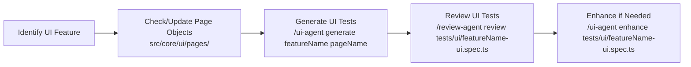
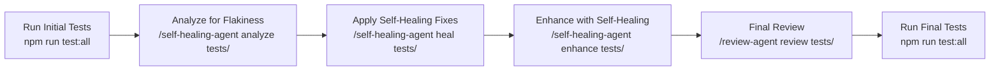

# Playwright Testing Framework Workflow Guide

This document outlines the recommended workflow for using the opencode agents with your existing Playwright testing framework, showing how all components work together in a cohesive development cycle.

## Overall Workflow Philosophy

**Documentation (.agent) → Executable Agents (.opencode) → Actionable Commands**

- **.agent folder**: Contains the _reference documentation_ - what the best practices, standards, and workflows are
- **.opencode folder**: Contains _executable agent definitions_ - how to apply those practices through slash commands
- **Your terminal**: Where you execute the slash commands to get work done

This separation ensures:

1. Single source of truth for standards (in .agent)
2. Easy application of those standards (through .opencode agents)
3. No duplication - agents implement, documentation explains

## Standard Development Workflow

Here's the recommended sequence of operations for adding new features or modifying existing ones:

### Phase 1: API/Service Changes (Backend-Focused)

```mermaid
graph LR
    A[Update OpenAPI Spec<br/>pet.yaml] --> B[Run Code Generation]
    B --> C[Generate Types<br/>npm run generated-api-type]
    C --> D[Generate Services<br/>npm run generated-service]
    D --> E[Generate Factories<br/>npm run generated-factory]
    E --> F[Generate Index Files<br/>npm run index-generated]
    F --> G[Generate API Tests<br/>/api-agent generate pet addPet]
    G --> H[Review API Tests<br/>/review-agent review tests/api/pet-add-pet.spec.ts]
    H --> I[Enhance if Needed<br/>/api-agent enhance tests/api/pet-add-pet.spec.ts]
```



### Phase 2: UI Changes (Frontend-Focused)



### Phase 3: Test Stabilization & Quality Assurance



## Detailed Step-by-Step Examples

### Example 1: Adding New API Endpoint

1. **Update your OpenAPI specification** (`pet.yaml`) with new endpoint
2. **Generate updated code**:
   ```bash
   npm run generated-api-type    # Updates src/core/api/types/
   npm run generated-service     # Updates src/core/api/services/
   npm run generated-factory     # Updates src/core/api/factories/
   npm run index-generated       # Updates all index.ts files
   ```
3. **Generate comprehensive test cases**:
   ```bash
   /api-agent generate pet updatePetById
   ```
   This creates `tests/api/pet-update-pet-by-id.spec.ts` with:
   - All 6 test sections (Happy Path, Invalid Input, etc.)
   - Proper use of fixtures and factories
   - Parallel test configuration
   - 3+ assertions per test
   - Following your naming/tagging conventions
4. **Review the generated tests**:
   ```bash
   /review-agent review tests/api/pet-update-pet-by-id.spec.ts
   ```
5. **Enhance if needed** (add business-specific scenarios):
   ```bash
   /api-agent enhance tests/api/pet-update-pet-by-id.spec.ts
   ```
6. **Run the tests**:
   ```bash
   npm run test:api
   ```

### Example 2: Adding New UI Feature

1. **Ensure Page Object exists** (or create/update it):
   - `src/core/ui/dashboardPage.ts`
   - `src/core/ui/widgets/chartWidget.ts`
2. **Generate UI tests**:
   ```bash
   /ui-agent generate dashboard dashboardPage
   ```
   This creates `tests/ui/dashboard-ui.spec.ts` with:
   - Proper imports from `src/core/ui/fixtures/uiFixture`
   - Page Object Model encapsulation (no direct locators in spec)
   - `test.beforeEach` for navigation only
   - Web-First Assertions preference
   - Proper tagging for UI tests
3. **Review and enhance** as above
4. **Run UI tests**:
   ```bash
   npm run test:happy
   ```

### Example 3: Stabilizing Flaky Tests

1. **Identify potentially flaky tests**:
   ```bash
   /self-healing-agent analyze tests/
   ```
   Outputs report showing:
   - Tests with hardcoded waits (`page.waitForTimeout`)
   - Brittle locators (index-based, overly specific XPath)
   - Missing test isolation
   - Poor error handling
2. **Apply automatic fixes**:
   ```bash
   /self-healing-agent heal tests/api/pet-api.spec.ts
   ```
   This modifies the test file to:
   - Replace `waitForTimeout` with intelligent waiting
   - Improve locator robustness
   - Add retry mechanisms for API calls
   - Enhance test isolation
3. **Add advanced self-healing capabilities**:
   ```bash
   /self-healing-agent enhance tests/ui/login-ui.spec.ts
   ```
   This adds:
   - Smart locator strategies with fallbacks
   - Automatic state recovery (handling unexpected modals)
   - Constraint-aware test data generation
4. **Verify fixes**:
   ```bash
   npm run test:all -- --retries=0  # Run without retries to see true stability
   ```

## Integration with Existing Scripts

Your current npm scripts work seamlessly with the agent system:

| Your Script                  | Purpose                          | How Agents Use It                      |
| ---------------------------- | -------------------------------- | -------------------------------------- |
| `npm run generated-api-type` | Generate OpenAPI types           | Prerequisite for `@api-agent generate` |
| `npm run generated-service`  | Generate service implementations | Prerequisite for `@api-agent generate` |
| `npm run generated-factory`  | Generate test data factories     | Used by agents for test data           |
| `npm run index-generated`    | Generate index files             | Ensures proper imports work            |
| `npm run test:all`           | Run all tests                    | Used after agent-generated tests       |
| `npm run lint`               | Code quality check               | Complements `@review-agent`            |

## Pre-Commit Hook Enhancement

Consider adding this to your `.husky/pre-commit` to ensure quality:

```bash
#!/bin/sh
. "$(dirname "$0")/_/husky.sh"

echo 'Running quality checks...'

# Run lint
npm run lint || {
  echo '❌ Linting failed. Please fix linting errors before committing.'
  exit 1
}

# Check for .only tests (optional but recommended)
if grep -r "\.only" tests/ --include="*.spec.ts"; then
  echo '❌ Found .only tests. Please remove them before committing.'
  exit 1
fi

# Quick review of staged changes (optional)
# npx opencode /review-agent review --staged

echo '✅ Quality checks passed.'
exit 0
```

## Key Benefits of This Workflow

1. **Consistency**: Every generated test follows your exact standards
2. **Efficiency**: Boilerplate handled automatically, you focus on business logic
3. **Quality**: Built-in review and self-healing capabilities maintain standards
4. **Traceability**: Clear path from spec → code → tests → validation
5. **Scalability**: Same process works for APIs, UI, and backend services

## When to Use Which Agent

| Scenario                               | Recommended Agent(s)           | Command Example                        |
| -------------------------------------- | ------------------------------ | -------------------------------------- |
| New API endpoint from OpenAPI spec     | `@api-agent` + codegen scripts | `/api-agent generate pet getPetById`   |
| New UI feature requiring test coverage | `@ui-agent`                    | `/ui-agent generate checkout cartPage` |
| Code quality check before PR           | `@review-agent`                | `/review-agent review src/`            |
| Flaky test identification              | `@self-healing-agent`          | `/self-healing-agent analyze tests/`   |
| Fixing known flaky tests               | `@self-healing-agent`          | `/self-healing-agent heal tests/`      |
| Adding self-healing capabilities       | `@self-healing-agent`          | `/self-healing-agent enhance tests/`   |
| Generating service/factory/types       | `@codegen-agent`               | `/codegen-agent generate pet`          |
| Reviewing existing test quality        | `@review-agent`                | `/review-agent tests/`                 |

This workflow ensures that your testing framework remains robust, maintainable, and aligned with your documented best practices while minimizing manual effort through intelligent automation.
